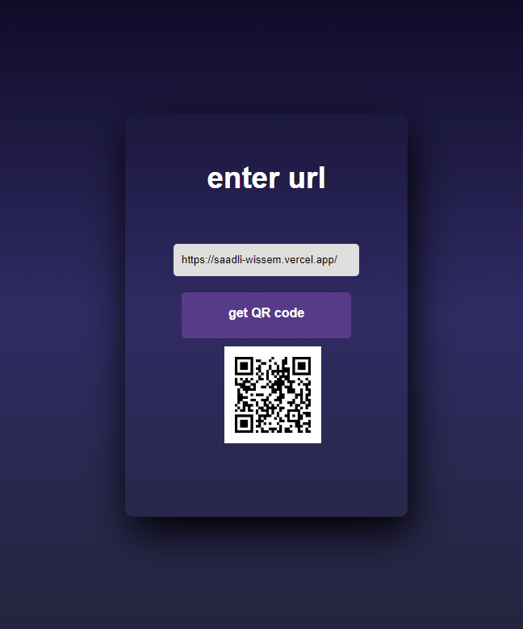

## Available Scripts

In the project directory, you can run:

### `npm start`

Runs the app in the development mode.\
Open [http://localhost:3000](http://localhost:3000) to view it in your browser.

The page will reload when you make changes.\
You may also see any lint errors in the console.

1) first step you need is to download the zip file or clone the repo 
2) the you can run the app with npm start command 
3) enter the url you need to generate a qQR code for it and click the button a Qr code will be generated 

feel free to click the star on the top of the repo 

thnx <3 

### sceenShot 

